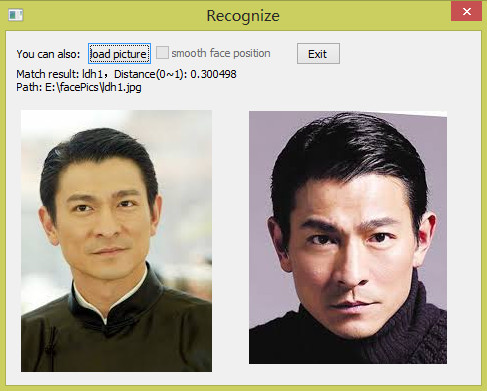

This program is written in VC++, built with MS Visual Studio 2012. OpenCV is used. The demo can detect faces from webcam or pictures, then identify it according to the enrolled database. It allows you to train your own classfier using your own pictures, as well as save or load your classifiers or face databases.

In order to reduce the size of the downloading pack, the default classifier (the .frmat file) is not very strong yet. We encourage you to train your own classifier using more pictures. You can edit the default classifier, default algorithms and other configs of the demo in "config.ini".

I am translating the Demo UI from Chinese into English, which means you can still see some Chinese in the demo, but the algorithm codes are all in English. 

